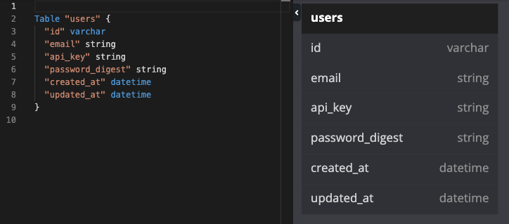
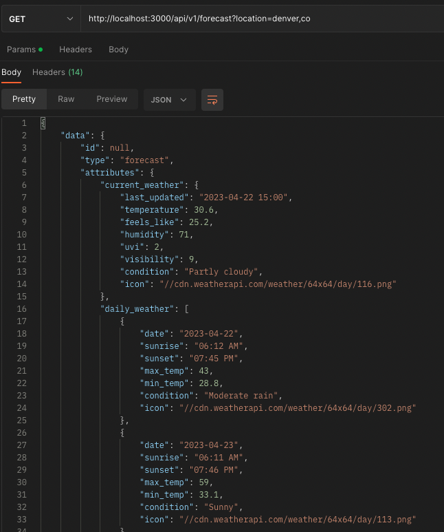
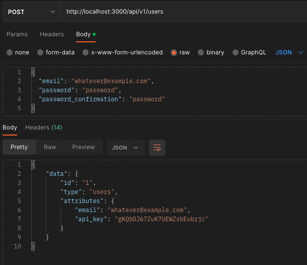
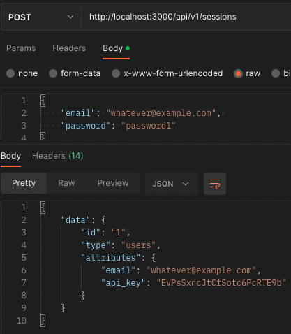
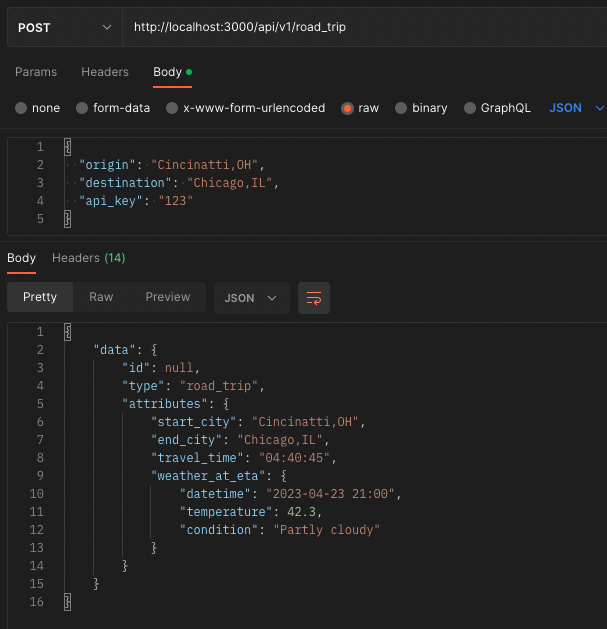

<a name="readme-top"></a>

<!-- PROJECT LOGO -->
<br />
<div align="center">

  <h2 align="center"><strong>Sweater Weather</strong></h2>

  <p align="center">
    Module 3 Final Project<br>
    Turing School of Software and Design<br>
    Cohort: 2211 Back End
    <br />
  </p>
</div>


### Built With

 
 


Gems Used: Pry, simplecov, capybara, shoulda-matchers, figaro, faraday, bcrypt, jsonapi-serializer, vcr, webmock


<!-- ABOUT THE PROJECT -->
## About The Project
<hr>

[Sweater Weather](https://backend.turing.edu/module3/projects/sweater_weather/) is the final project for the Turing School's module 3 back end program. Throughout module 3, we have learned about consuming and exposing APIs. This project allows students to replicate what could be a real world example of working with the front end team, by exposing an API that the front end can use.
<br> 
Sweater Weather will allow users to not only see the duration of their road trip, but the forecasted weather at their destination once they arrive. 

## Learning Goals
<hr>
<ul>
  <li>Expose an API that aggregates data from multiple external APIs</li> 
  <li>Expose an API that requires an authentication token</li>
  <li>Expose an API for CRUD functionality</li>
  <li>Determine completion criteria based on the needs of other developers</li>
  <li>Test both API consumption and exposure, making use of at least one mocking tool (VCR, Webmock, etc).</li>
</ul>


<p align="right">(<a href="#readme-top">back to top</a>)</p>


<!-- GETTING STARTED -->
## Getting Started
<p>* Before running these steps, make sure you have the correct versions of ruby, rails, and the API keys. See Configuration and Keys below *</p>

1. Fork and clone this repo
`git clone git@github.com:KaraJoHo/sweater_weather.git`
2. Run bundle install in your terminal
`bundle install`
3. Set up the database by running:
`rails db:{drop,create,migrate,seed}`
4. Run rails s to start the server
`rails s`
5. Open postman to test the endpoints 
If you don't have postman, go to https://www.postman.com to install it and read about use. You can access one endpoint from your browser by searching `http://localhost:3000/api/v1/forecast?location=denver,co` <br>
However, for the `post` requests, you will need to use postman to test those endpoints.
  

### Configuration
* Ruby version 3.1.1
* Rails version 7.0.4

### Keys

_This project uses both Mapquest and WeatherAPI. Keys are free and easy to get, and will be needed to properly run this on your local machine. See the links below to get your own keys, and where/how to use them._

1. Look under the getting started section for a [Weather API](https://www.weatherapi.com/docs/) key
2. Click on sign up, in Join the Community for a [MapQuest API](https://developer.mapquest.com/documentation/) key
3. Finally, to secure and hide your keys, install the[Figaro](https://github.com/laserlemon/figaro) gem. This will give you an `application.yml` file to store your keys for use.

4. Enter your API key in `application.yml`
   ```js
   API_KEY = 'ENTER YOUR API KEY'
   ```

<p align="right">(<a href="#readme-top">back to top</a>)</p>

## Testing 
<p>To run tests, type this in your terminal: </p>

 `bundle exec rspec` 
<p>All tests should be passing</p>
<hr>

## Schema 

<hr>


<!-- USAGE EXAMPLES -->
## Endpoint Requests and Responses

#### Here are some examples of requests and responses ran in Postman.
<br>

<details>
  <summary><strong>Endpoints</strong></summary>
   <br>
   <hr>
  
   `GET /api/v1/forecast?location=denver,co`

   
   <br>
   <hr>

   `POST /api/v1/users`

   
   <br>
   <hr>

   `POST /api/v1/sessions`

   
   <br>
   <hr>

   `POST /api/v1/road_trip`

   
   <br>
   <hr>
</details><br>
<hr>


<p align="right">(<a href="#readme-top">back to top</a>)</p>


<!-- CONTACT -->
## Contact

Reach out anytime on [LinkedIn](https://www.linkedin.com/in/81012911-91208/)

<p align="right">(<a href="#readme-top">back to top</a>)</p>

